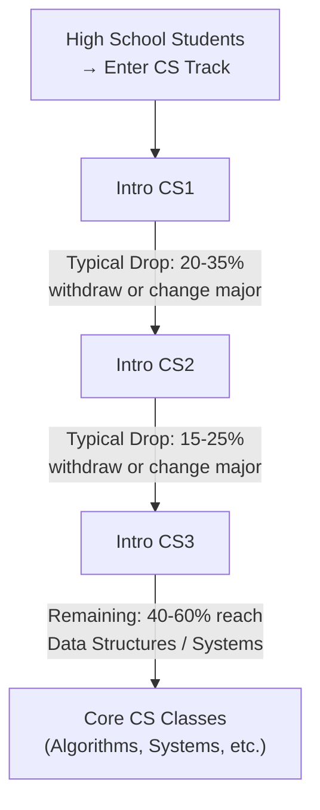

## Notes

### Why the Drop After CS1 (20-35% attrition)

The CS1 → CS2 transition represents the biggest conceptual jump in the curriculum:

- **Conceptual leap**: CS1 focuses on basic syntax and simple programs, while CS2 introduces:
  - Object-oriented programming concepts
  - More complex data structures
  - Software design patterns
  - Larger project organization
- **Increased complexity**: Students must now think about program architecture, not just individual functions
- **Preparation gap**: Many students underestimate required preparation:
  - Python fundamentals (not just syntax, but idioms and best practices)
  - Problem decomposition skills
  - Math comfort level
  - Practice with structured homework and debugging
- **Reality check**: CS1 may feel manageable, but CS2 reveals the true rigor of computer science

### Other Transitions

- CS2 → CS3: algorithmic + debugging load increases significantly
- Many students who survive CS1 → CS2 still struggle with the increased complexity in CS3
