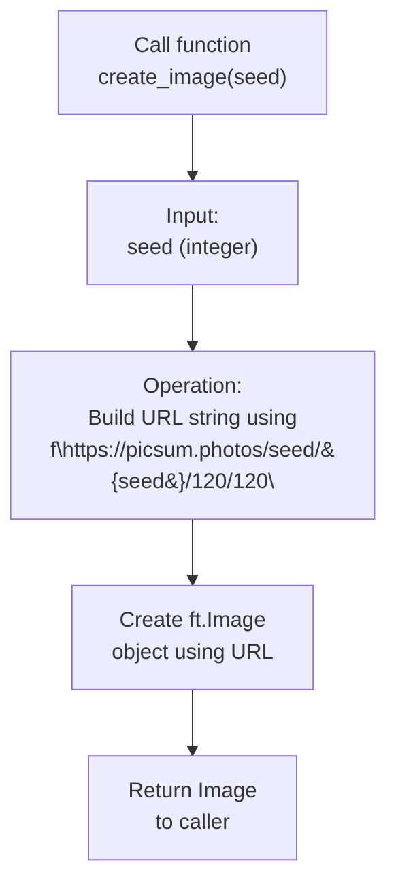

```mermaid
flowchart TD
    B["Call function<br/>create_image(seed)"]
    B --> C["Input:<br/>seed (integer)"]
    C --> D["Operation:<br/>Build URL string using<br/>f\"https://picsum.photos/seed/&#123;seed&#125;/120/120\""]
    D --> E["Create ft.Image<br/>object using URL"]
    E --> F["Return Image<br/>to caller"]
```
