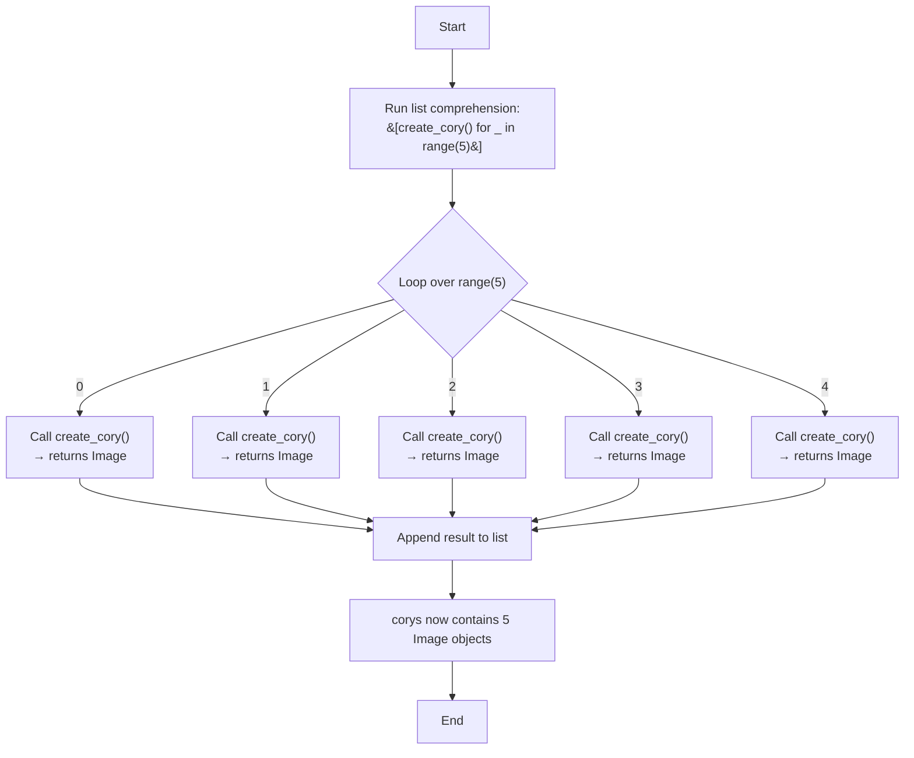

# List Comprehension Flowchart

```mermaid
flowchart TD

    A[Start] --> B["Run list comprehension:<br/>&#91;create_cory() for _ in range(5)&#93;"]

    B --> C{"Loop over range(5)"}
    C -->|0| D0["Call create_cory()<br/>→ returns Image"]
    C -->|1| D1["Call create_cory()<br/>→ returns Image"]
    C -->|2| D2["Call create_cory()<br/>→ returns Image"]
    C -->|3| D3["Call create_cory()<br/>→ returns Image"]
    C -->|4| D4["Call create_cory()<br/>→ returns Image"]

    D0 --> L[Append result to list]
    D1 --> L
    D2 --> L
    D3 --> L
    D4 --> L

    L --> F[corys now contains 5 Image objects]
    F --> G[End]
```
