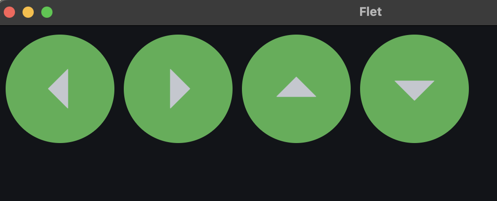
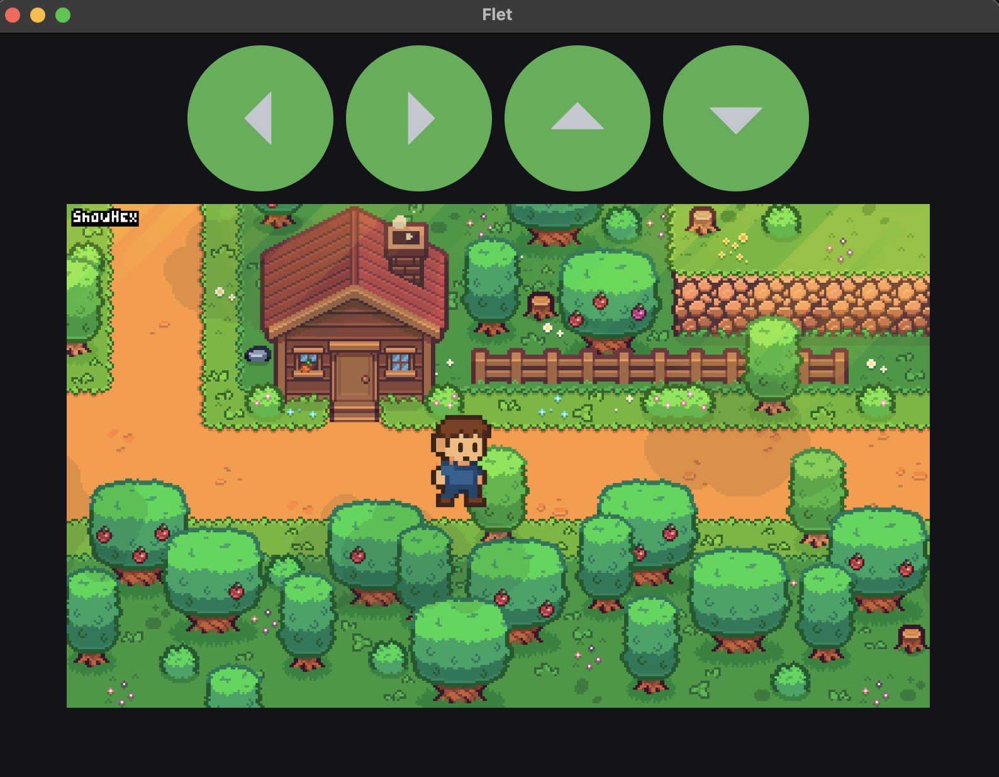

# Flet Python Beginner Module 2

## icon buttons

- human computer interaction with UI buttons
- separating UI button and program logic
- basic computer program architecture - separating logic into functions away from UI
- flet icons and icon browser
- flet IconButton with properties for bgcolor, on_click, icon_size
- ft.Row - practice
- Python function definition practice - no input parameter yet
- using if name is main convention

## Module 2.2 Character Movement

- flet stack for absolute positioning and layers
- add speed to character edge to change position - update property of instantiated object
- use single variable or constant for speed instead of integers throughout code. Easier to update a single variable
- group similar objects into a larger object. example: game_controller has four objects
- += augmented assignment operator or compound assignment operator
